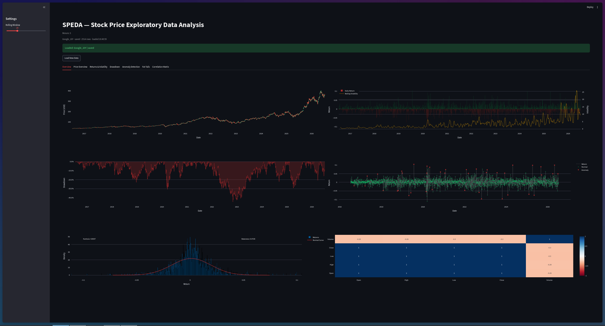
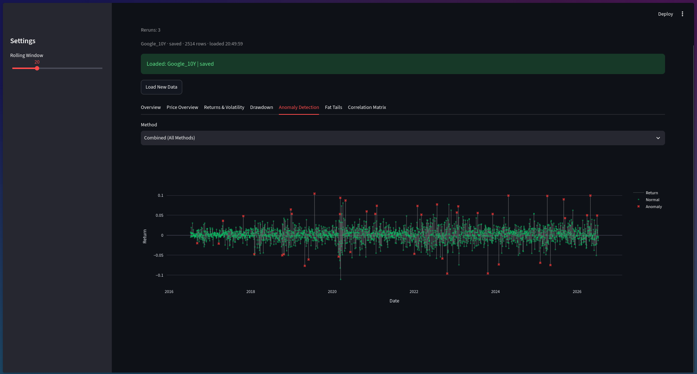

# SPEDA — Stock Price Exploratory Data Analysis


A full EDA pipeline and interactive dashboard for stock price analysis. Pulls historical data for any ticker, engineers features, runs three-layer anomaly detection, and surfaces everything through a six-tab Streamlit app with Plotly charts.
---

## Project Structure

```
SPEDA/
├── main.py                    # Entry point, CLI pipeline
├── Dashboard/
│   └── dash.py                # Streamlit dashboard
├── data/
│   └── loader.py              # yfinance data loading and CSV caching
├── features/
│   └── features.py            # Feature engineering
├── analysis/
│   ├── anomaly.py             # Anomaly detection (IQR, Z-score, Isolation Forest)
│   ├── fattails.py            # Fat tails, kurtosis, skewness
│   └── drawdown.py            # Drawdown analysis
└── plots/
    ├── plots.py               # Matplotlib plotting functions (Phase 1)
    └── plotly_plots.py        # Plotly plotting functions (Phase 2)
```

---

## Features

### Phase 1 — Backend EDA Pipeline
- **Data loading** — yfinance integration with local CSV caching
- **Feature engineering** — daily returns, rolling mean, volatility, net profit
- **Fat tails analysis** — return histogram with normal curve overlay, kurtosis and skewness
- **Candlestick charts** — OHLC visualisation
- **Drawdown analysis** — cumulative max drawdown over time
- **Three-layer anomaly detection**:
  - Rolling IQR — point outliers in returns
  - Rolling Z-score — local spikes relative to recent window
  - Isolation Forest — multivariate, globally unusual days
  - Consensus `Flagged` column — days flagged by 2+ methods
- **Modular structure** — all functions importable, works across any ticker

### Phase 2 — Streamlit Dashboard
- Interactive Plotly charts with scroll-to-zoom, pan, hover tooltips
- Load new tickers via yfinance or load saved CSVs
- Quick-select popular tickers (META, AAPL, GOOGL, MSFT, TSLA, NVDA, AMZN, SPY, QQQ)
- Global rolling window control
- Six analysis tabs: Price Overview, Returns & Volatility, Drawdown, Anomaly Detection, Fat Tails, Correlation Matrix
- Overview tab with all plots on a single screen
- Correlation heatmap with presets and rolling toggle

---

## Usage

### Dashboard
```bash
cd Dashboard
streamlit run dash.py
```

Load any ticker via the dialog, select a period, and explore the six analysis tabs. Data is cached locally as CSV so you don't re-fetch on every run.

### CLI / Import
All modules are stateless and accept a pandas DataFrame — drop them into any pipeline:

```python
from data.loader import load_new, load_raw, save
from analysis.anomaly import anomaly_detection
from analysis.fattails import get_kurtosis, get_skewness
from analysis.drawdown import drawdown_analysis

df = load_new("AAPL", "1y")
df = anomaly_detection(df)
print(get_kurtosis(df))
```

---

## Screenshots

**Overview — all analysis at a glance**


**Anomaly Detection — three-method consensus flagging**


---

## Dependencies

```bash
pip install -r requirements.txt
```

pandas, numpy, matplotlib, seaborn, scipy, yfinance, scikit-learn, streamlit, plotly

---

## Key Findings (META 10y)
- Kurtosis ~19 — extreme fat tails, returns are far from normally distributed
- Max drawdown ~75% (2021–2022 rate hike period)
- Anomaly detection flags ~5% of trading days as high-confidence outliers
- Profitable days ~53% of trading days

---

## Roadmap
- [x] Phase 1: Modular EDA pipeline
- [x] Phase 2: Streamlit dashboard with Plotly
- [ ] Multi-ticker comparison
- [ ] Sharpe ratio and risk-adjusted return metrics
- [ ] Statistical significance testing on anomalies
- [ ] Automated interpreted EDA report